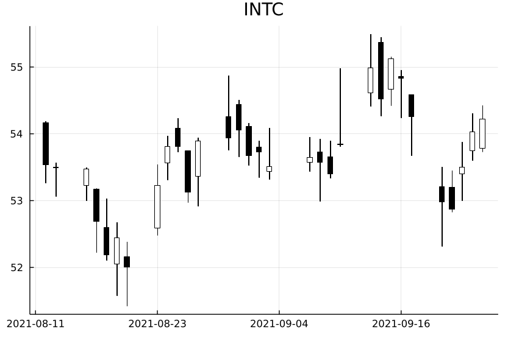

# ForecastPlots

Collection of plot functionalities for time series analysis. The available plots are:

- `acf`:     Auto-Correlation plot
- `candle`:  Candelstick plot for stock prices
- `ccf`:     Cross-Correlation plot
- `dplot`:   Decomposition plot for Data, Trend, Seasonality and Remainder.
- `fplot`:   Multivariate forecasting plots with prediction intervals.
- `pacf`:    Partial Auto-Correlation plot
- `splot`:   Seasonal plot, similar to `monthplot` in R.

